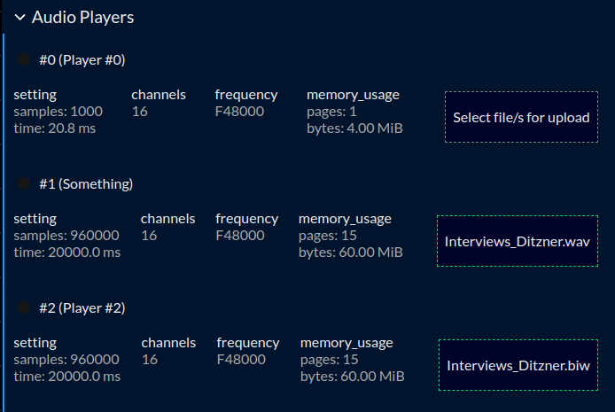

# Audio Player

## Overview

The RePlay audio player is part of the AT300's player feature. It is used to load audio files into its RAM storage usable as audio sources afterwards. Due to the non-persistency of RAM, loaded files will not be available after a reboot.

## Creating a player

To create a player instance ready for uploading files to it, you have to first create a player and set its capabilities. The most common and necessary settings are the capacity, number of channels and the frequency.
The capacity can be set up by either entering a time duration in seconds or as a fixed number of samples.

> [!NOTE]
> Please note that the num_channels should have at least the number of channels of the uploaded files and that the capacity is defined large enough.

When the player is set up, there a multiple ways to define its source material.

## Upload from PC per GUI

The common upload is the function provided by the landing page to select files from a PC to upload to the blade. It accepts files in the formats .biw and .wav. Selected WAVs will be converted on-the-fly before being loaded to the player.

To upload a file, click on the element showing "Select file/s for upload" or drag-and-drop a file onto it. If the clip fits into the reserved memory of the player (shown as `memory usage`) it will be uploaded and afterwards, the player will receive the command to start playing. Its activity status is shown as a green dot next to its name.

## VSK and curl

With the latest vsk version you can convert .wav files to .biw with the command:

`vsk wav to-biw YourWavFile.wav YourNewFile.biw`

and afterwards you can send the .biw file to a player with:

`curl -v -T YourNewFile.biw "http://<IPofYourBlade>/replay/audio?action=write&handler=<IndexOfYourAudioPlayer>&store=clip_single_file"`

E.g. send file to machine "172.16.2.3" to audio player #0: `curl -v -T YourNewFile.biw "http://172.16.2.3/replay/audio?action=write&handler=0&store=clip_single_file"`