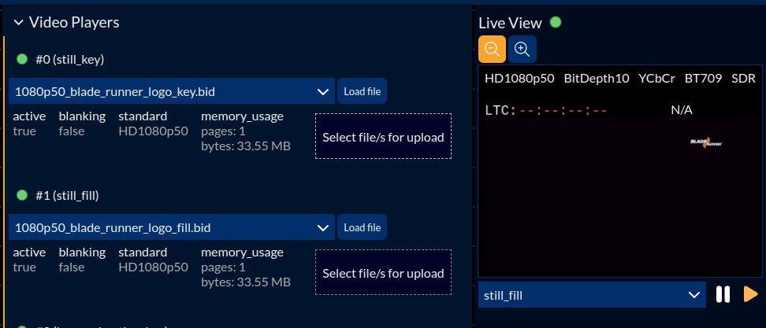

# Video Player

## Overview

The RePlay video player is part of the AT300's player feature. It is used to load clips and stills into its RAM storage usable as video sources afterwards. Due to the non-persistency of RAM, loaded files will not be available after a reboot. From version 2.5, the video player has a feature to use persistent storage like USB sticks to solve this issue.

## Creating a player

To create a player instance ready for uploading files to it, you have to first create a player and set its capabilities. The most common and necessary settings are the capacity, blanking and the max bandwidth constraints.
The capacity can be set up by either entering a time duration in seconds or as a fixed number of frames.
If your file contains blanking data, you have to set `add_blanking` to `true` in the input caliber settings.
The constraints can be set to "Standard" or "Bandwidth". The "Standard" option will set a fixed standard which will also prevent files not of this standard from being loaded. The "Bandwidth" option is much more flexible and only sets the bandwidth limit the player is allowed to reserve. For example `b3_0Gb` would allow every clip up to 3G to be loaded, denying UHD sizes.

Please note that setting a bandwidth or standard will always reserve resources for the allowed maximum, even if unused later.

When the player is set up, there a multiple ways to define its source material.

## Upload from PC

The common upload is the function provided by the landing page to select files from a PC to upload to the blade. It accepts files in the formats .bid and .png. Selected PNGs will be converted on-the-fly before being loaded to the player.



To upload a file, click on the element showing "Select file/s for upload" or drag-and-drop a file onto it. If the clip fits into the reserved memory of the player (shown as `memory usage`) it will be uploaded and afterwards, the player will receive the command to start playing. Its activity status is shown as a green dot next to its name.


## Upload from USB device

To upload files from a USB stick, you have to copy your files in the .bid format to the root directory of a formatted USB stick. Please note that the clips should not be in subdirectories.

```
/media/YourUSBStick
    |
    +-- file1.bid
    |
    +-- file2.bid
    ..
```

When your USB stick is connected to the front usb-c port, you can click on the dropdown of a player. The menu will show all files found on the device and by clicking on an entry, write the path of the selected file to the players `upload.file` keyword. The player will now load the selected file after a reboot. If it also should be uploaded immediately, click the "Load file" button next to the dropdown.