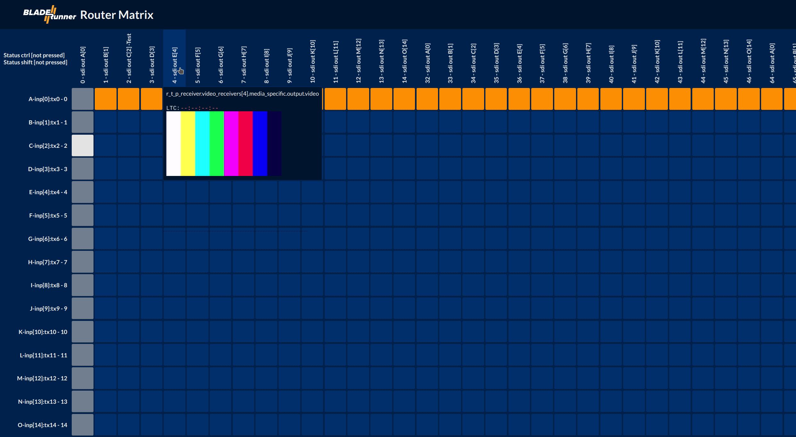

# BLADE//master

You can configure and run BLADE//master on a AT300 blade. To do so, copy a valid configuration json file named "config_general.json" into the `/config/ember/` directory on your AT300. Afterwards, go to the advanced UI -> System -> Services and enable "ember".

In a browser, open the GUI of your blade and look into the menu, a link to the blade matrix should appear that forwards you to the crossbar GUI, ready to route and show your video streams with live view.

