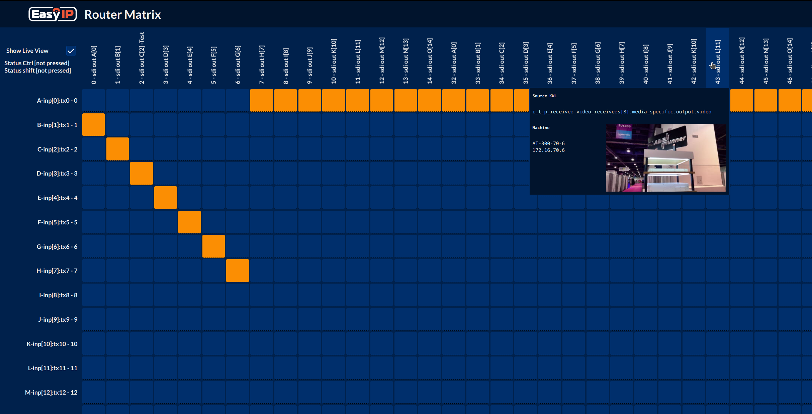

# Ember+ control

You can configure and run the ember+ control software on a AT300 blade. To do so, copy a valid configuration json file named "config_general.json" into the `/config/ember/` directory on your AT300. Afterwards, go to the advanced UI -> System -> Services and enable "ember".

A valid configuration file can look like this (description of config file [here](https://hub.docker.com/r/arkonatechnologies/blade-master)):

```json
{
    "server_port" : 9000,
    "ui_port" : 5000,
    "fast_routing":false,
    "global_video_matrix_target":
    {
        "instances":"created",
        "path": "rx-end",
        "exclude":["HEAD"]
    },
    "global_video_matrix_source":
    {
        "instances":"created",
        "path": "tx-end",
        "exclude":["HEAD"]
    },
    "machines" :[
    {
        "blade": "http://172.16.136.2",
        "name": "AT300-136"
    },
    {
        "blade": "http://172.16.163.2",
        "name": "AT300-163"
    }
]
```

In a browser, open the GUI of your blade and look into the menu, a link to the blade matrix should appear that forwards you to the crossbar GUI, ready to route and show your video streams with live view.

