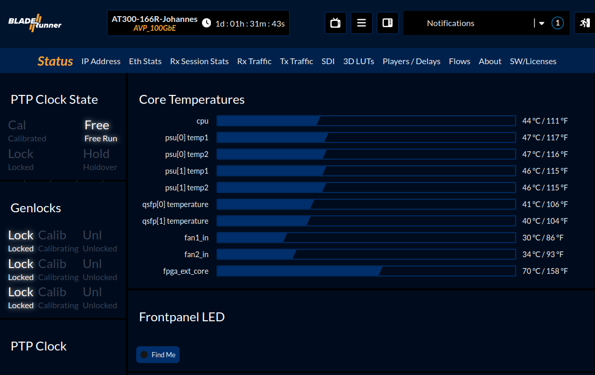
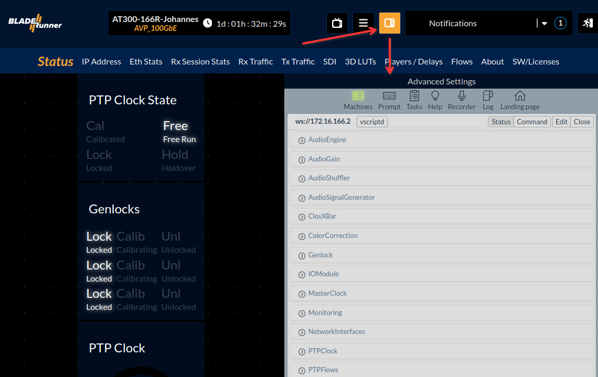
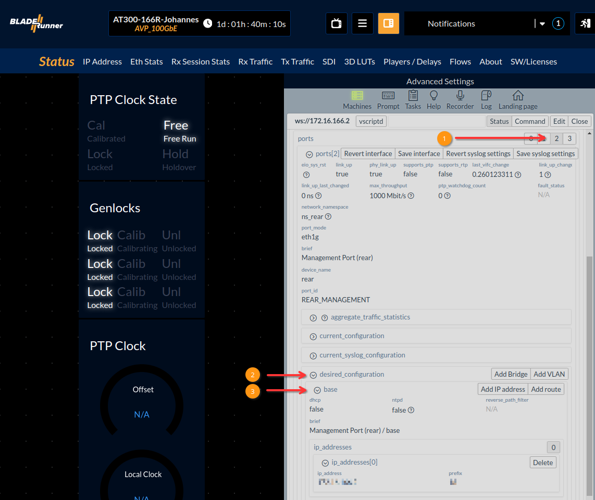
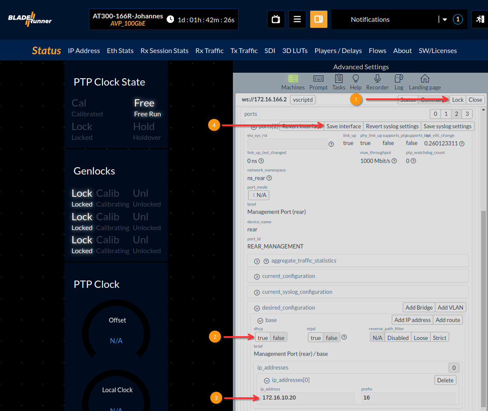
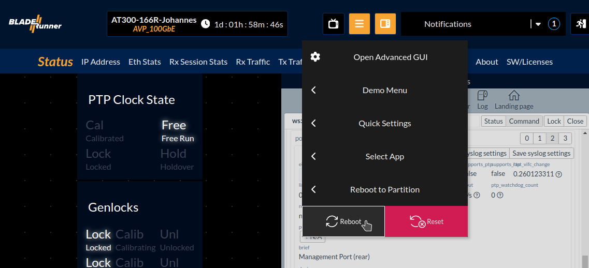

# IP Setup

The setup of IP addresses on AT300 can be done via cli, scripting or GUI. This guide will show you how to define IP addresses via GUI.

You can connect through any port of the AT300, the mini USB will need further steps thought. You can read about how to get access to the AT300 by connecting your smartphone to it [here](serial-connection.md).

AT300 has four ports listed as available ethernet ports:
 
 - port 0 (top QSFP28 front port, default `DHCP`)
 - port 1 (bottom QSFP28 front port, default `DHCP`)
 - port 2 (rear RJ45 port on the frames central management module, default `DHCP`)
 - port 3 (front USB-C port, default `172.16.2.3`)

> [!NOTE] Starting from the assumption that the AT300 has its default settings (dhcp on all ports except front usb c) and that the dhcp address remains unknown, you can connect to the USB-C port by attaching a USB-C to RJ45 connector. By default, port 3 has the static IP address `172.16.2.3/16`. Configure your PC's interface to be in the same subnet range to reach that.

When connected, open a browser and enter the IP address of the connected port, e.g. `172.16.2.3` for port 3.

Further steps show how to change the rear management interface from dhcp to a static IP address. The procedure is that same for all ports.

That will open the landing page as shown below.

> [!NOTE] Adding IP addresses will be included to the landing page section "IP addresses" later, currently it's only possible to change existing static IP configurations of the ports on it.

Click on the icon on the right of the burger menu to open adanced settings to the side.

In the advanced settings area, go to "NetworkInterfaces" and:

  1) click on button "2" to open settings of port 2.
  2) click on "desired_configuration" > base
  3) If there's no button "0" besides "ip_addresses", click the "Add IP address" button to create a new one

After that, edit the configuration as below:

  1) first enable the Edit mode by clicking the "Edit" button. When enabled, the button text will change to "Lock" as in the picture
  2) Switch off DHCP
  3) Enter the desired IP address to the "ip_address" field and prefix to the "prefix" field (!Always hit `Enter` to confirm the field change!)
  4) Click on "Save interface"

Reboot from the burger menu to boot with your configuration

