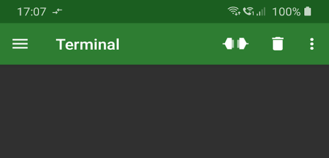
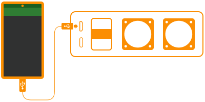
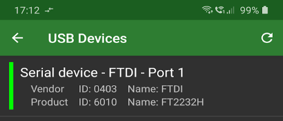
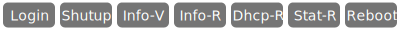

# Serial Connection to AT300

There are multiple ways to connect to an AT300 blade via serial port. In this short documentation you will see how to connect from a linux PC or with a software tool "Serial USB Terminal" for android smartphones.

## Connecting from linux

- Install the software "tio" from with your usual package manager.
- look for the device which as physically attached to the front micro USB port with `ls -l /dev/ttyUSB*`
- execute tio with the device that you found, e.g. `tio ttyUSB0`
  - tios default settings (baudrate 115200 etc.) are already correct to establish the connection

## Serial USB Terminal

<!-- In this short guide you will see how to:

- Connect a smartphone via serial connection to a blade
- Configure basic setups like IP addresses via smartphone

This guide is based on an android app called "Serial USB Terminal" and will provide some command examples. -->

### Get prerequisites

To get going, you'll need:

- The app:
  - Go to the google app store and download "[Serial USB Terminal](https://play.google.com/store/apps/details?id=de.kai_morich.serial_usb_terminal&hl=de&gl=US)". (This setup has been tested with version 1.53)
- A cable to connect your phone to the micro USB front port of the AT300


### Setup

1. Open Serial USB Terminal on your phone
2. Load the <a href="https://raw.githubusercontent.com/arkona-technologies/blade-runner-user-guides/main/setup/serial_usb_terminal_cfg.txt?raw" download target="_blank">Configuration File</a> by clicking on the config button in the upper right corner (the button showing three dots - also known as the kabob menu) and then "configuration -> import"



3. Connect your phone to the blade 



4. In the app, go to "USB Devices" 



5. Click on the serial device the app has found 

6. You should see a `connected to FTDI device` message and also a row of buttons:



7. Clicking on the "Login" button at the bottom, a message like this should appear
   - Note: After logging in, you can also deactivate the “neighborhood-watch” messages if necessary by pressing the “Shutup” button.

```
[neighborhood-watch][AT300-59] p0@172.16.59.0 p1@172.16.59.1 rear@172.16.59.2
root
Password:
AT300-59:/
root # [neighborhood-watch][AT300-59] p0@172.16.59.0 p1@172.16.59.1 rear@172.16.59.2
```

8. The "Info-R" button will show you the current rear port address configuration
   - Note: "Info-V" button shows all vlan-/mac-/ip-addresses

9. With "Stat-R" you can change the rear mgmt IP address due to the configuration (default: 172.16.2.2/16) of the button
   - Note: see config file or by holding down the button the IP address can be edited (incl. the entire command)

10. Reboot machine with "Reboot" button 


#### Config file example

[Config example](./serial_usb_terminal_cfg.txt)
