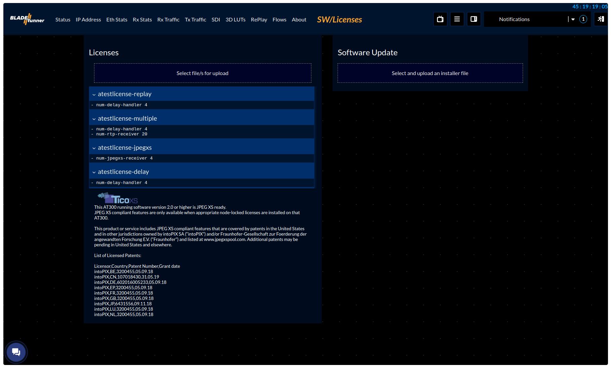
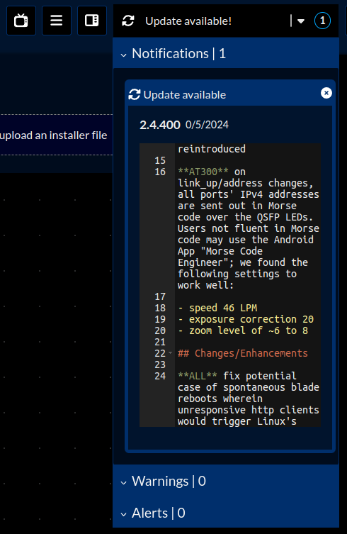

## Software Update

To perform a software update you need to have connection to your blade and know its IP address. Per default all ports are set to DHCP mode, except for the front port which is set to the fixed IP address "172.16.2.3". You can plug in a USB-C to Ethernet adapter to the front USB-C port and connect your blade to a switch or directly to your PC. 

> [!NOTE]
> If you connect to the front port with its fixed IP address, don't forget to adjust the settings of your PC to be in the same subnet. For example, set a fixed IP like "172.16.2.4" with the subnet mask "255.255.0.0".

If you have trouble connecting to the blade, please go through the [IP setup](ip.md) first.

To perform a software update:

**1.** [Download latest software](https://www.dropbox.com/scl/fo/48fo8h9fl8exzzta4de0r/ANwE702r86pDo6B1SBPmhbw?rlkey=5ig6q7qls6hoxdutgkdkqh8p8&st=vyr6jc60&dl=0)

> [!NOTE]
> For regular updates of the user/system partitions, use the one without the "RPU" at the end. 
> Doing this twice will update both user/system partitions (rebooting in between). 
> The "RPU" version is required to update the recovery partition if you want to do so.

**2.** Open a browser and go to `http://<IP of your blade>` to open the landing page.

**3.** Click on the `SW/Licenses` button in the menu.

**4.** Click the large box under `Software Update` to select an installation file, or drag and drop it from your desktop to upload the installation file.

**5.** Once the upload is complete, you can review the changelogs and start the installation by clicking the appropriate button.

> [!NOTE]
> For newer versions, a prompt will also appear asking if you want to save the current settings before installing/updating.

### Notifications

If your browser has a internet connection, the GUI will check for available updates and if so enlist them in the notifications list:

