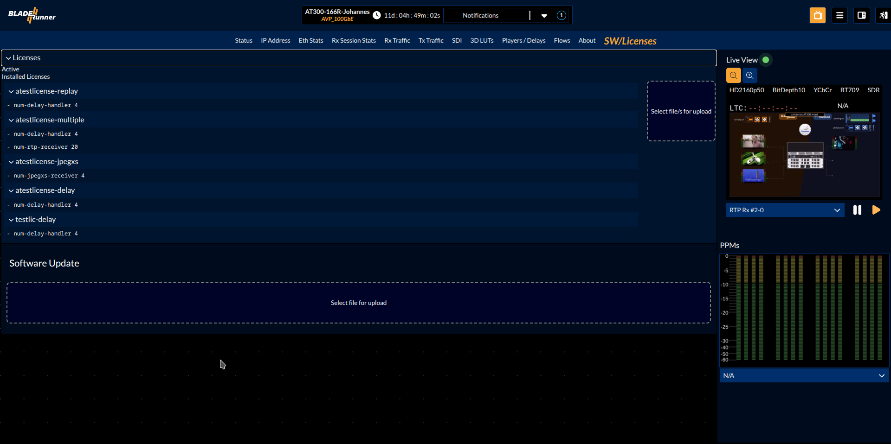

## Software Update

To perform a software update you need to have connection to your blade and know its IP address. Per default all ports are set to DHCP mode, except for the front port which is set to the fixed IP address "172.16.2.3". You can plug in a USB-C to Ethernet adapter to the front USB-C port and connect your blade to a switch or directly to your PC. 

> [!NOTE]
> If you connect to the front port with its fixed IP address, don't forget to adjust the settings of your PC to be in the same subnet. For example, set a fixed IP like "172.16.2.4" with the subnet mask "255.255.0.0".

1. Open a browser and go to `http://<IP of your blade>` to open the landing page.
1. Click on the `SW/licenses` button in the menu.
1. Click the big blue field below "Software Update" to select or drag and drop an installer file from your desktop into it to upload the installer file.
1. When the upload has finished, you can read through the changelogs and start the installation by clicking the green button.

### Notifications

If your browser has a internet connection, the GUI will check for available updates and if so enlist them in the notifications list:

